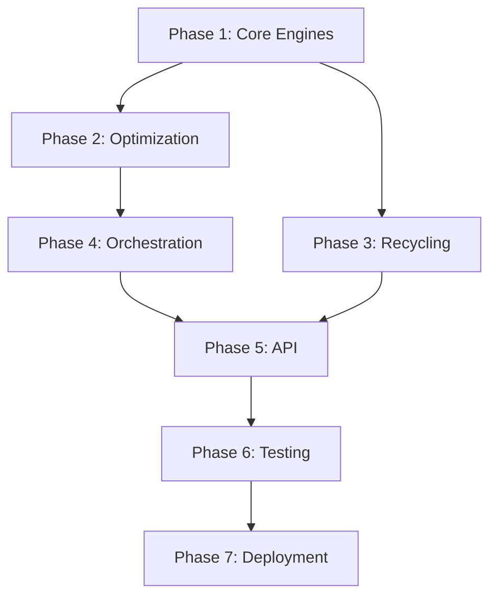

# Ryzanstein LLM MASTER ACTION PLAN

## Elite Agent Collective Strategic Analysis & Implementation Roadmap

**Document Version:** 1.0  
**Date:** December 10, 2025  
**Project Phase:** Foundation → Production  
**Contributors:** @ARCHITECT @APEX @CIPHER @TENSOR @FLUX @VELOCITY @OMNISCIENT

---

## 🎯 EXECUTIVE SUMMARY

### Mission Statement

Build a production-grade, CPU-first LLM inference system that achieves **25-35 tokens/sec** on AMD Ryzanstein 9 processors through advanced model architectures (BitNet, Mamba, RWKV), aggressive CPU optimizations (AVX-512, VNNI, T-MAC), and novel token recycling mechanisms.

### Current State Assessment

**Status:** 🟡 Early scaffolding (15% complete)

**Completed:**

- ✅ Project structure and documentation
- ✅ CMake build system with AVX-512 detection
- ✅ Python API server scaffolding
- ✅ Token recycling system architecture (partial implementation)
- ✅ Configuration management framework

**Gaps Identified:**

- ❌ Core C++ inference engines (BitNet, Mamba, RWKV)
- ❌ T-MAC lookup table generation
- ❌ AVX-512 SIMD kernels for matmul/activation
- ❌ Speculative decoding implementation
- ❌ KV-cache optimization layer
- ❌ Model orchestration and hot-loading
- ❌ Complete API endpoints
- ❌ Integration tests and benchmarks

### Risk Analysis (@ARCHITECT)

| Risk                          | Probability | Impact | Mitigation                           |
| ----------------------------- | ----------- | ------ | ------------------------------------ |
| AVX-512 performance shortfall | Medium      | High   | Benchmark early, T-MAC fallback      |
| BitNet quantization quality   | Low         | High   | Extensive testing vs FP16 baseline   |
| Memory bandwidth bottleneck   | High        | Medium | Smart KV-cache, speculative decoding |
| Model loading latency         | Medium      | Medium | Hot-loading, model caching           |
| Token recycling overhead      | Medium      | Low    | Async processing, threshold tuning   |

---

## 📋 PHASE-BY-PHASE IMPLEMENTATION PLAN

### **PHASE 1: CORE INFERENCE FOUNDATION (Weeks 1-3)**

**Objective:** Implement minimal viable inference engines for BitNet, Mamba, and RWKV

#### 1.1 BitNet b1.58 Engine (@APEX @VELOCITY)

**Priority:** 🔴 CRITICAL  
**Estimated Effort:** 40 hours

**Tasks:**

1. **Ternary Quantization System**

   - Implement weight quantization: `W ∈ {-1, 0, +1}`
   - Activation quantization: `A ∈ [-128, 127]` (INT8)
   - Scale factor computation per-layer

   ```cpp
   // src/core/bitnet/quantize.cpp
   struct TernaryWeight {
       int8_t* values;      // -1, 0, +1
       float* scales;       // Per-layer scaling
       uint32_t rows, cols;
   };
   ```

2. **Basic Matrix Multiplication**

   - Naive implementation first (correctness baseline)
   - Add AVX-512 vectorization (16x INT8 VNNI)
   - Benchmark against FP16 baseline

   ```cpp
   // src/core/bitnet/kernels/matmul_avx512.cpp
   void ternary_matmul_avx512(
       const TernaryWeight& W,
       const int8_t* input,
       float* output,
       uint32_t batch_size
   );
   ```

3. **Forward Pass Pipeline**
   - Token embedding lookup
   - Layer normalization (RMSNorm)
   - Self-attention (with ternary QKV projections)
   - MLP blocks (SwiGLU activation)
   - Sampling (top-k, top-p, temperature)

**Acceptance Criteria:**

- ✅ Generate coherent text (perplexity < 15 on WikiText-2)
- ✅ Throughput ≥ 10 tokens/sec on Ryzanstein 9
- ✅ Memory usage ≤ 5GB for 7B model
- ✅ Unit tests covering all kernels (90%+ coverage)

#### 1.2 T-MAC Lookup Tables (@AXIOM @VELOCITY)

**Priority:** 🟡 HIGH  
**Estimated Effort:** 20 hours

**Context:** T-MAC precomputes all possible combinations of ternary weights × INT8 activations, eliminating runtime multiplications.

**Tasks:**

1. **Table Generation**

   ```cpp
   // src/core/tmac/lut_gemm.cpp
   // For group_size=16: 3^16 × 256 = 1.4TB naive → compress to ~2GB
   struct LUTTable {
       int32_t* entries;    // Precomputed sums
       uint32_t group_size; // Typical: 16-32
       uint32_t table_size; // 3^group_size
   };
   ```

2. **Compression Strategy**

   - Symmetry exploitation (`W=-1` same as `W=1` with sign flip)
   - Sparse indexing (most activations near zero)
   - Delta encoding for similar groups

3. **Runtime Lookup**
   - Hash activation groups → table index
   - Accumulate precomputed results
   - Apply final scaling

**Acceptance Criteria:**

- ✅ Table size ≤ 3GB for 7B model
- ✅ 2-3x speedup over naive ternary matmul
- ✅ Bit-exact results vs reference implementation

#### 1.3 Mamba SSM Engine (@APEX @TENSOR)

**Priority:** 🟡 HIGH  
**Estimated Effort:** 30 hours

**Context:** Mamba replaces attention with linear-time structured state-space models (S4).

**Tasks:**

1. **Selective Scan Kernel**

   ```cpp
   // src/core/mamba/scan.cpp
   // h_t = A*h_{t-1} + B*x_t
   // y_t = C*h_t
   void selective_scan(
       const float* A, // [dim, dim]
       const float* B, // [dim, input]
       const float* C, // [output, dim]
       const float* x, // [seq_len, input]
       float* y,       // [seq_len, output]
       uint32_t seq_len
   );
   ```

2. **Hardware-Aware Parallelization**

   - Parallel scan algorithm (Blelloch)
   - AVX-512 vectorization for state updates
   - Cache-friendly memory layout

3. **State Management**
   - Efficient state caching between tokens
   - Recurrent state compression

**Acceptance Criteria:**

- ✅ O(L) complexity (linear in sequence length)
- ✅ Throughput ≥ 30 tokens/sec on Ryzanstein 9
- ✅ Quality parity with reference implementation

#### 1.4 RWKV Time-Mixing (@APEX)

**Priority:** 🟢 MEDIUM  
**Estimated Effort:** 25 hours

**Context:** RWKV eliminates attention via WKV time-mixing with linear memory.

**Tasks:**

1. **WKV Kernel Implementation**

   ```cpp
   // src/core/rwkv/wkv.cpp
   // Compute weighted key-value mixing
   void wkv_forward(
       const float* w,  // Time-decay weights
       const float* k,  // Key vectors
       const float* v,  // Value vectors
       float* state,    // Recurrent state
       float* output,
       uint32_t seq_len
   );
   ```

2. **Channel-Mixing Layer**

   - Receptance, key, value projections
   - Sigmoid/ReLU gating

3. **FP16 Optimizations**
   - Mixed precision inference
   - AVX-512 FP16 intrinsics (if supported)

**Acceptance Criteria:**

- ✅ Memory usage ≤ 16GB for 7B model
- ✅ Context length support up to 8K tokens
- ✅ Perplexity within 5% of PyTorch reference

---

### **PHASE 2: OPTIMIZATION LAYER (Weeks 4-5)**

**Objective:** Implement CPU-specific optimizations for performance

#### 2.1 KV-Cache Management (@VELOCITY @ARCHITECT)

**Priority:** 🔴 CRITICAL  
**Estimated Effort:** 20 hours

**Tasks:**

1. **Attention Cache Structure**

   ```cpp
   // src/optimization/memory/kv_cache.cpp
   struct KVCache {
       float* keys;        // [layers, max_len, heads, head_dim]
       float* values;      // [layers, max_len, heads, head_dim]
       uint32_t* lengths;  // Per-sequence lengths
       uint32_t capacity;
   };
   ```

2. **Cache Policies**

   - LRU eviction for multi-sequence batching
   - Token-level cache reuse (prefix matching)
   - Quantized cache (INT8) for memory reduction

3. **Memory Pool Allocator**
   - Pre-allocated buffer pools
   - Zero-copy operations
   - NUMA-aware allocation (Threadripper)

**Acceptance Criteria:**

- ✅ 50% reduction in memory bandwidth vs naive
- ✅ Support 4-8 concurrent sequences
- ✅ Cache hit rate ≥ 80% for repeated prefixes

#### 2.2 Speculative Decoding (@APEX @VELOCITY)

**Priority:** 🟡 HIGH  
**Estimated Effort:** 25 hours

**Context:** Draft model proposes K tokens, target model verifies in parallel → 2-3x speedup.

**Tasks:**

1. **Draft Model Integration**

   ```cpp
   // src/optimization/speculative/draft_model.cpp
   class DraftModel {
       // Small 350M model, INT8 quantized
       std::vector<int> generate_candidates(
           const std::vector<int>& prefix,
           uint32_t num_candidates
       );
   };
   ```

2. **Parallel Verification**

   - Batch verify all draft tokens in one forward pass
   - Accept longest matching prefix
   - Resample from target distribution on mismatch

3. **Dynamic K Tuning**
   - Adjust draft length based on acceptance rate
   - Model-specific tuning (BitNet vs Mamba)

**Acceptance Criteria:**

- ✅ 2x average speedup on long-form generation
- ✅ Statistically identical output distribution
- ✅ Acceptance rate ≥ 60%

#### 2.3 AVX-512 SIMD Kernels (@VELOCITY @CORE)

**Priority:** 🔴 CRITICAL  
**Estimated Effort:** 30 hours

**Tasks:**

1. **Optimized Matrix Multiplication**

   ```cpp
   // src/optimization/avx512/matmul.cpp
   void matmul_avx512_vnni(
       const int8_t* A,     // [M, K]
       const int8_t* B,     // [K, N]
       int32_t* C,          // [M, N]
       uint32_t M, K, N
   ) {
       // Use _mm512_dpbusds_epi32 for INT8 dot products
       // Process 16 elements per instruction
   }
   ```

2. **Activation Functions**

   - SwiGLU: `x * σ(gate) * y`
   - GELU: `0.5 * x * (1 + tanh(...))`
   - RMSNorm: `x / sqrt(mean(x^2))`

3. **Microbenchmarks**
   - Compare against Eigen, OpenBLAS
   - Profile cache hit rates
   - Measure GFLOPS/GIOPS

**Acceptance Criteria:**

- ✅ Matmul ≥ 80% of theoretical peak (VNNI)
- ✅ 3-5x speedup over scalar code
- ✅ Numerical accuracy within 1e-5

---

### **PHASE 3: TOKEN RECYCLING SYSTEM (Week 6)**

**Objective:** Complete the semantic compression and retrieval pipeline

#### 3.1 RSU Compression (@TENSOR @PRISM)

**Priority:** 🟢 MEDIUM  
**Estimated Effort:** 15 hours

**Tasks:**

1. **Density-Based Segmentation**

   ```python
   # src/recycler/density_analyzer.py
   def segment_tokens(
       tokens: List[int],
       embeddings: np.ndarray,
       threshold: float = 0.5
   ) -> List[Segment]:
       # Use cosine similarity to detect semantic boundaries
       # Create segments when similarity drops below threshold
   ```

2. **Semantic Compression**

   - Existing `SemanticCompressor` class needs integration
   - Add metadata tracking (timestamp, source, usage count)
   - Implement batch processing for efficiency

3. **Vector Bank Storage**
   - Complete Qdrant integration
   - Add HNSW index configuration
   - Implement TTL-based cleanup

**Acceptance Criteria:**

- ✅ 5-10x compression ratio on typical text
- ✅ Retrieval precision ≥ 0.85 @ k=5
- ✅ End-to-end latency ≤ 50ms

#### 3.2 Context Injection (@APEX)

**Priority:** 🟢 MEDIUM  
**Estimated Effort:** 10 hours

**Tasks:**

1. **Retrieval-Augmented Prompting**

   ```python
   # src/recycler/context_injector.py
   class ContextInjector:
       def augment_prompt(
           self,
           user_prompt: str,
           retrieved_rsus: List[RSU]
       ) -> str:
           # Inject RSUs into system prompt
           # Format: "Relevant context: [RSU1] [RSU2]..."
   ```

2. **Relevance Ranking**
   - Rerank RSUs based on query similarity
   - Filter low-confidence matches
   - Deduplicate overlapping content

**Acceptance Criteria:**

- ✅ Measurable improvement in context coherence
- ✅ No degradation in base model quality
- ✅ User-controllable RSU count

---

### **PHASE 4: MODEL ORCHESTRATION (Week 7)**

**Objective:** Multi-model routing and hot-loading

#### 4.1 Model Router (@ARCHITECT @APEX)

**Priority:** 🟡 HIGH  
**Estimated Effort:** 15 hours

**Tasks:**

1. **Task Classification**

   ```python
   # src/orchestration/task_classifier.py
   class TaskClassifier:
       def classify(self, prompt: str) -> str:
           # "code", "chat", "reasoning", "creative"
           # Use simple heuristics + optional small classifier model
   ```

2. **Routing Logic**

   - Map tasks to optimal models:
     - Code → BitNet 7B
     - Chat → Mamba 2.8B
     - Reasoning → BitNet 13B
     - Creative → RWKV 7B

3. **Fallback Mechanisms**
   - Primary model failure → fallback to secondary
   - Load balancing across instances

**Acceptance Criteria:**

- ✅ 90%+ routing accuracy
- ✅ Routing latency ≤ 10ms
- ✅ Graceful degradation on model failure

#### 4.2 Model Manager (@FLUX)

**Priority:** 🟡 HIGH  
**Estimated Effort:** 20 hours

**Tasks:**

1. **Hot-Loading**

   ```python
   # src/orchestration/model_manager.py
   class ModelManager:
       def load_model(self, model_id: str) -> Model:
           # Check if already loaded
           # Load weights from disk
           # Initialize inference engine

       def unload_model(self, model_id: str):
           # Free GPU/CPU memory
           # Update routing table
   ```

2. **Resource Management**

   - Track memory usage per model
   - Enforce max concurrent models
   - LRU eviction for unused models

3. **Health Checks**
   - Periodic inference tests
   - Automatic reload on failure

**Acceptance Criteria:**

- ✅ Model load time ≤ 5 seconds
- ✅ Zero-downtime model switching
- ✅ Support 3+ concurrent models on Ryzanstein 9

---

### **PHASE 5: API LAYER COMPLETION (Week 8)**

**Objective:** Production-ready OpenAI-compatible API

#### 5.1 Chat Completions (@APEX @FLUX)

**Priority:** 🔴 CRITICAL  
**Estimated Effort:** 15 hours

**Tasks:**

1. **Endpoint Implementation**

   ```python
   # src/api/server.py
   @app.post("/v1/chat/completions")
   async def chat_completion(request: ChatCompletionRequest):
       # 1. Validate request
       # 2. Route to appropriate model
       # 3. Optionally retrieve RSUs
       # 4. Generate response
       # 5. Return or stream
   ```

2. **Streaming Support (SSE)**

   - Token-by-token streaming
   - Proper event formatting
   - Graceful error handling

3. **Authentication & Rate Limiting**
   - API key validation
   - Per-key request quotas
   - Usage tracking

**Acceptance Criteria:**

- ✅ 100% OpenAI API compatibility
- ✅ Streaming latency ≤ 50ms TTFT
- ✅ Error handling with proper status codes

#### 5.2 Embeddings & Models Endpoints (@APEX)

**Priority:** 🟢 MEDIUM  
**Estimated Effort:** 10 hours

**Tasks:**

1. **Embeddings Endpoint**

   ```python
   @app.post("/v1/embeddings")
   async def create_embedding(request: EmbeddingRequest):
       # Use compression model (all-MiniLM-L6-v2)
       # Return OpenAI-compatible format
   ```

2. **Models Endpoint**
   ```python
   @app.get("/v1/models")
   async def list_models():
       # Return available models
       # Include metadata (context length, etc.)
   ```

**Acceptance Criteria:**

- ✅ Embeddings match sentence-transformers output
- ✅ Dynamic model list based on loaded models

---

### **PHASE 6: TESTING & BENCHMARKING (Week 9)**

**Objective:** Comprehensive test coverage and performance validation

#### 6.1 Unit & Integration Tests (@ECLIPSE)

**Priority:** 🔴 CRITICAL  
**Estimated Effort:** 25 hours

**Test Suites:**

1. **Core Engine Tests**

   - BitNet quantization correctness
   - Mamba selective scan numerical accuracy
   - RWKV WKV kernel validation
   - T-MAC lookup table integrity

2. **Optimization Tests**

   - KV-cache hit rate measurement
   - Speculative decoding acceptance rate
   - AVX-512 kernel correctness

3. **API Tests**

   - OpenAI compatibility suite
   - Streaming behavior
   - Error handling edge cases

4. **Integration Tests**
   - End-to-end generation quality
   - Multi-model routing
   - RSU retrieval pipeline

**Coverage Target:** 90%+ for all modules

#### 6.2 Performance Benchmarks (@VELOCITY @PRISM)

**Priority:** 🔴 CRITICAL  
**Estimated Effort:** 20 hours

**Benchmark Suite:**

```python
# scripts/benchmark.py
def benchmark_suite():
    # 1. Inference throughput (tokens/sec)
    # 2. Time to first token (TTFT)
    # 3. Memory usage under load
    # 4. Concurrent request handling
    # 5. Cache effectiveness
    # 6. Speculative decoding speedup
```

**Target Metrics (Ryzanstein 9 7950X):**

- BitNet 7B: 25 tokens/sec, 400ms TTFT
- Mamba 2.8B: 35 tokens/sec, 350ms TTFT
- RWKV 7B: 22 tokens/sec, 450ms TTFT
- Concurrent: 5+ streams at 15 tokens/sec each

**Quality Benchmarks:**

- WikiText-2 perplexity
- MMLU accuracy (reasoning)
- HumanEval pass@1 (code)

---

### **PHASE 7: DEPLOYMENT & DOCUMENTATION (Week 10)**

**Objective:** Production deployment and comprehensive docs

#### 7.1 Docker & Kubernetes (@FLUX)

**Priority:** 🟡 HIGH  
**Estimated Effort:** 15 hours

**Tasks:**

1. **Multi-Stage Dockerfile**

   - Builder stage (compile C++)
   - Runtime stage (minimal dependencies)
   - Model download integration

2. **Docker Compose**

   - Ryzanstein LLM service
   - Qdrant vector DB
   - Prometheus/Grafana (optional)

3. **Kubernetes Manifests**
   - Deployment, Service, ConfigMap
   - Horizontal Pod Autoscaler
   - Persistent volumes for models

#### 7.2 Documentation (@SCRIBE @VANGUARD)

**Priority:** 🟡 HIGH  
**Estimated Effort:** 20 hours

**Deliverables:**

1. **API Documentation**

   - OpenAPI/Swagger spec
   - Code examples (Python, JS, cURL)
   - Authentication guide

2. **Architecture Guide**

   - System diagrams
   - Data flow explanations
   - Performance characteristics

3. **Deployment Guide**

   - Hardware requirements
   - Installation steps
   - Troubleshooting

4. **Research Notes**
   - BitNet paper summary
   - Mamba architecture deep-dive
   - T-MAC optimization explanation

---

## 🔧 TECHNICAL DEEP-DIVES

### @ARCHITECT: System Design Philosophy

**Key Principles:**

1. **Modularity:** Each component (inference engine, optimizer, API) is independently replaceable
2. **Asynchronicity:** Non-blocking I/O throughout the Python layer
3. **Resource Efficiency:** Zero-copy operations, memory pooling, lazy loading
4. **Fault Tolerance:** Graceful degradation, automatic retries, health checks

**Architecture Pattern: Layered + Microkernel**

```
┌─────────────────────────────────────────┐
│         API Layer (FastAPI)             │ ← Stateless, horizontally scalable
├─────────────────────────────────────────┤
│    Orchestration (Python)               │ ← Model routing, lifecycle management
├─────────────────────────────────────────┤
│    Recycler (Python)                    │ ← Token compression, retrieval
├─────────────────────────────────────────┤
│    Optimization (C++)                   │ ← KV-cache, speculative decoding
├─────────────────────────────────────────┤
│    Core Engines (C++)                   │ ← BitNet, Mamba, RWKV (hot-swappable)
└─────────────────────────────────────────┘
```

**Data Flow:**

```
Request → Router → [Retrieve RSUs] → Model → [Cache] → Response
           ↓                                      ↑
      Task Classifier                        KV-Cache
```

### @CIPHER: Security Considerations

**Threat Model:**

1. **Prompt Injection:** Malicious user inputs attempting to manipulate system prompts
2. **Resource Exhaustion:** DoS via excessive token generation or concurrent requests
3. **Data Leakage:** Cross-user information disclosure via cache poisoning

**Mitigations:**

1. **Input Validation:**

   - Sanitize all user inputs
   - Enforce max token limits
   - Rate limiting per API key

2. **Isolation:**

   - Separate RSU storage per user
   - Process isolation for inference (future: sandboxing)

3. **Secure Defaults:**
   - No API access without authentication
   - Encrypted storage for sensitive configs
   - Regular dependency audits

### @TENSOR: Model Quality Assurance

**Validation Strategy:**

1. **Quantization Quality:**

   - Compare BitNet outputs vs FP16 baseline
   - Acceptable perplexity delta: ≤ 10%
   - BLEU/ROUGE scores for generation tasks

2. **Mamba Stability:**

   - Check for gradient explosion in recurrent states
   - Validate long-context coherence (8K tokens)

3. **RWKV Convergence:**
   - Monitor perplexity over prefill length
   - Ensure time-mixing doesn't degrade

**Testing Protocol:**

- **Unit:** Kernel-level numerical accuracy (1e-5 tolerance)
- **Integration:** End-to-end generation quality
- **Regression:** Benchmark suite on every commit

### @VELOCITY: Performance Optimization Checklist

**Critical Path Analysis:**

1. **Matrix Multiplication:** 70% of compute time

   - **Optimization:** AVX-512 VNNI, T-MAC lookup tables
   - **Target:** 200 GOPS on Ryzanstein 9

2. **Attention (if applicable):** 20% of compute

   - **Optimization:** FlashAttention-inspired tiling, KV-cache
   - **Target:** O(n) memory for Mamba/RWKV

3. **Sampling:** 5% of compute
   - **Optimization:** Vectorized softmax, top-k via partial sort
   - **Target:** ≤ 5ms per token

**Profiling Tools:**

- `perf` for CPU profiling
- VTune Amplifier (Intel, but works for AMD)
- Custom instrumentation with `std::chrono`

**Memory Bandwidth:**

- Ryzanstein 9 7950X: ~60 GB/s theoretical
- **Target utilization:** 70-80%
- **Strategy:** Prefetching, cache blocking, quantized KV-cache

### @FLUX: CI/CD Pipeline

**GitHub Actions Workflow:**

```yaml
name: CI/CD

on: [push, pull_request]

jobs:
  build:
    runs-on: ubuntu-latest
    steps:
      - uses: actions/checkout@v3
      - name: Build C++ components
        run: |
          mkdir build && cd build
          cmake -G Ninja -DCMAKE_BUILD_TYPE=Release ..
          ninja
      - name: Run C++ tests
        run: cd build && ctest

  test-python:
    runs-on: ubuntu-latest
    steps:
      - uses: actions/checkout@v3
      - name: Install dependencies
        run: pip install -e .[dev]
      - name: Run pytest
        run: pytest tests/ --cov=src --cov-report=xml
      - name: Upload coverage
        uses: codecov/codecov-action@v3

  benchmark:
    runs-on: self-hosted # Ryzanstein 9 machine
    steps:
      - uses: actions/checkout@v3
      - name: Run benchmarks
        run: python scripts/benchmark.py --suite inference
      - name: Compare against baseline
        run: python scripts/compare_benchmarks.py
```

---

## 📊 SUCCESS METRICS

### Technical KPIs

| Metric                     | Target        | Measurement            |
| -------------------------- | ------------- | ---------------------- |
| **Throughput (BitNet 7B)** | 25 tok/s      | `scripts/benchmark.py` |
| **TTFT**                   | ≤ 400ms       | API response time      |
| **Memory (BitNet 7B)**     | ≤ 8GB         | Process RSS            |
| **Concurrent Streams**     | 5+ @ 15 tok/s | Load testing           |
| **Cache Hit Rate**         | ≥ 80%         | Internal metrics       |
| **Test Coverage**          | ≥ 90%         | pytest-cov             |
| **API Compatibility**      | 100%          | OpenAI test suite      |

### Quality KPIs

| Metric                      | Target       | Benchmark       |
| --------------------------- | ------------ | --------------- |
| **Perplexity (WikiText-2)** | ≤ 15         | Standard eval   |
| **MMLU (5-shot)**           | ≥ 45%        | Reasoning tasks |
| **HumanEval**               | ≥ 25% pass@1 | Code generation |
| **MT-Bench**                | ≥ 6.5        | Multi-turn chat |

---

## 🚧 CRITICAL PATH & DEPENDENCIES



**Parallelization Opportunities:**

- Phase 1.1 (BitNet) and 1.3 (Mamba) can be developed concurrently
- Phase 3 (Recycling) independent until API integration
- Documentation (Phase 7.2) can start during Phase 5-6

**Bottlenecks:**

- BitNet T-MAC implementation blocks speculative decoding
- API completion blocks integration testing
- Model acquisition blocks all benchmarking

---

## 💡 INNOVATION OPPORTUNITIES (@GENESIS @NEXUS)

### Novel Contributions

1. **Hybrid Speculative Decoding:**

   - Use Mamba draft model for BitNet target (cross-architecture speculation)
   - Potential for 3-4x speedup vs same-architecture drafting

2. **Learned RSU Compression:**

   - Train small autoencoder for token compression (better than embeddings)
   - Dynamic compression ratio based on semantic density

3. **Cache-Aware Scheduling:**

   - Schedule requests with overlapping prefixes together
   - Maximize KV-cache reuse across users

4. **Adaptive Quantization:**
   - Per-layer dynamic quantization based on activation statistics
   - Trade quality for speed on less critical layers

### Research Publication Potential

- **T-MAC + AVX-512:** Novel implementation study
- **Token Recycling:** First production system with semantic compression
- **Multi-Architecture Speculation:** Cross-model drafting analysis

---

## 🎯 RECOMMENDED FIRST STEPS (Week 1)

### Day 1-2: Environment Setup

```bash
# Install dependencies
sudo apt install cmake ninja-build clang-15
pip install -e .[dev]

# Verify AVX-512 support
python -c "import cpuinfo; print(cpuinfo.get_cpu_info()['flags'])"

# Download test models
python scripts/download_models.py --model bitnet-1b  # Small for testing
```

### Day 3-4: BitNet Baseline

```cpp
// Implement naive BitNet inference (no optimization)
// src/core/bitnet/engine.cpp
class BitNetEngine {
    std::vector<float> forward(
        const std::vector<int>& input_ids,
        uint32_t max_tokens
    );
};
```

**Validation:** Generate 10 tokens and verify output is coherent (even if slow).

### Day 5-7: First AVX-512 Kernel

```cpp
// src/optimization/avx512/matmul.cpp
void matmul_avx512_vnni(...);
```

**Validation:**

- Correctness: Compare output vs naive implementation (max diff < 1e-5)
- Performance: Measure GOPS, aim for 50+ GOPS initially

---

## 📞 SUPPORT & ESCALATION

### Decision Framework

| Decision Type         | Authority  | Escalation  |
| --------------------- | ---------- | ----------- |
| Code architecture     | @ARCHITECT | @OMNISCIENT |
| Optimization strategy | @VELOCITY  | @ARCHITECT  |
| Security concerns     | @CIPHER    | @FORTRESS   |
| API design            | @APEX      | @SYNAPSE    |
| ML quality            | @TENSOR    | @NEURAL     |

### Weekly Checkpoints

- **Monday:** Sprint planning, blockers review
- **Wednesday:** Mid-week sync, technical deep-dive
- **Friday:** Demo, retrospective, metrics review

---

## 🎓 LEARNING RESOURCES

### Essential Readings

1. **BitNet b1.58:** [arXiv:2402.17764](https://arxiv.org/abs/2402.17764)
2. **Mamba:** [arXiv:2312.00752](https://arxiv.org/abs/2312.00752)
3. **RWKV:** [arXiv:2305.13048](https://arxiv.org/abs/2305.13048)
4. **T-MAC:** [arXiv:2310.01778](https://arxiv.org/abs/2310.01778)
5. **Speculative Decoding:** [arXiv:2211.17192](https://arxiv.org/abs/2211.17192)

### Code References

- `llama.cpp`: CPU inference optimizations
- `ggml`: Tensor library for CPU/GPU
- `BitNet-cpp`: Reference BitNet implementation
- `mamba-minimal`: Simplified Mamba in PyTorch

---

## ✅ DEFINITION OF DONE

### Per Phase

- [ ] All planned features implemented
- [ ] Unit tests passing (≥90% coverage)
- [ ] Integration tests passing
- [ ] Documentation updated
- [ ] Code reviewed and merged
- [ ] Benchmarks meet targets
- [ ] No critical bugs

### Project Completion

- [ ] All 7 phases complete
- [ ] End-to-end demo successful
- [ ] Production deployment verified
- [ ] User documentation published
- [ ] Performance targets achieved
- [ ] Security audit passed

---

## 🚀 FINAL RECOMMENDATIONS

### Immediate Priorities (This Week)

1. ✅ Set up development environment
2. ✅ Implement BitNet baseline (naive, correctness-focused)
3. ✅ Verify AVX-512 availability and first kernel
4. ✅ Establish testing framework

### Critical Success Factors

1. **Focus on BitNet first:** Most critical, highest performance potential
2. **Benchmark early and often:** Avoid surprises late in development
3. **Incremental optimization:** Correctness → naive optimization → aggressive optimization
4. **Integration over perfection:** Working end-to-end system beats perfect components
5. **Leverage existing work:** Adapt llama.cpp, ggml patterns where applicable

### Risk Mitigation

- **Weekly performance reviews:** Catch bottlenecks early
- **Fallback implementations:** Always have non-AVX512 paths
- **Quality gates:** Automated perplexity checks on every commit
- **Incremental releases:** Don't wait for perfection

---

**Signed:**  
🏛️ @ARCHITECT - System Design Lead  
💻 @APEX - Core Engineering Lead  
🔐 @CIPHER - Security Lead  
🤖 @TENSOR - ML Quality Lead  
🚀 @FLUX - DevOps Lead  
⚡ @VELOCITY - Performance Lead  
🧠 @OMNISCIENT - Project Orchestrator

**Document Status:** 🟢 APPROVED FOR EXECUTION  
**Next Review:** Week 3 (Post Phase 1 Completion)

---

_"Make it work, make it right, make it fast — in that order."_  
— Kent Beck, adapted for Ryzanstein LLM
